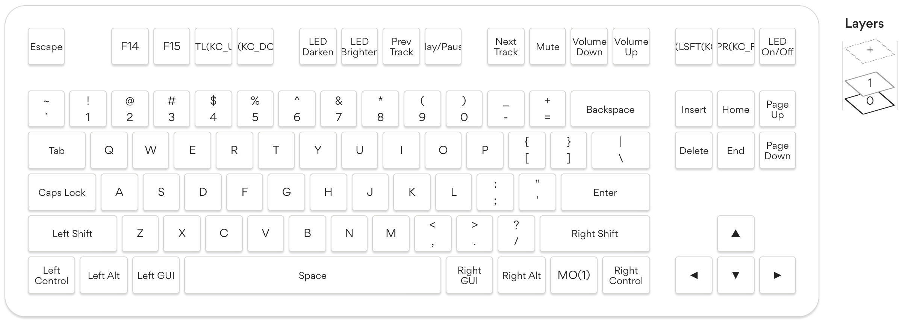
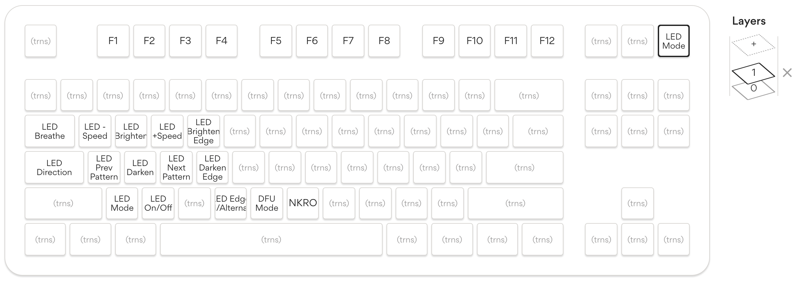

This is a layout based on the Keychron K8 wireless mechanical keyboard:


## Layout

Layer 0 (no modifiers):



Layer 1 (modified w/Fn)



## Required keyboard shortcuts

| Preference section | Shortcut            | Keys     |
| ---                | ---                 | ---      |
| Display            | Decrease brightness | F14    |
| Mission Control    | Mission Control     | ⌃↑ |
| | Application Windows `⌃↓`
| Services | Toggle Microphone* | ⌃⌥⇧⌘F10 † |

* This is an Automator 'quick action' with the script below

† Drop's configurator displays this as HYPR(KC_F10)

### Mic toggle AppleScript

```osascript
on run {input, parameters}
	set currentInputLevel to input volume of (get volume settings)
	
	if currentInputLevel is 0 then
		set volume input volume 65
	else
		set volume input volume 0
	end if
	
	return input
end run
```
